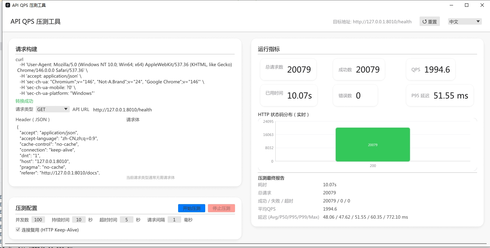

# API QPS DevTools (ReqWave)

<div align="center">
  <h3>⚡ Rust 编写的高性能 GUI API 压测工具 ⚡</h3>
  <p>专为开发者设计，基于 eframe (egui) + Tokio + Reqwest 构建。</p>
  <p>
    <a href="README.md">English</a> | 
    <a href="README_CN.md">简体中文</a>
  </p>
</div>

---

## 🌟 核心特性

- **🚀 极速压测**: 基于 Rust 异步运行时 `tokio` 和 `reqwest` 连接池，轻松达到单机数万 QPS。
- **📋 智能 Curl 解析**: 直接粘贴浏览器复制的 `cURL (bash)` 命令，自动解析 URL、Method、Headers 和 Body。
- **📊 实时监控**: 实时展示 QPS、延迟分位数、状态码分布和成功/失败计数。
- **📉 精准统计**: 使用 `hdrhistogram` 统计 P50、P95、P99 等高精度延迟指标。
- **🖥️ 跨平台 GUI**: 基于 `eframe` (即时模式 GUI)，支持 Windows、macOS 和 Linux，无需安装运行时。
- **🌐 多语言支持**: 内置中/英文一键切换。

## 📸 界面概览



## 🛠️ 快速开始

### 1. 运行

如果你安装了 Rust 环境：

```bash
cargo run --release
```

### 2. 使用步骤

1.  **复制请求**: 在 Chrome/Edge 开发者工具的网络面板中，右键点击请求 -> `Copy` -> `Copy as cURL (bash)`。
2.  **粘贴配置**: 将命令粘贴到左上角的输入框，工具会自动填充 API 地址、Headers 和 Body。
3.  **调整参数**: 设置并发数（Concurrency）、持续时间（Duration）等。
4.  **开始压测**: 点击 `开始压测` (Start Test) 按钮。
5.  **查看报告**: 观察右侧的实时指标和图表，结束后查看底部的最终统计报告。

### 3. 重置

点击顶部的 `↺ 重置` 按钮可一键恢复初始状态。

## ⚙️ 性能设计

- **连接复用**: 支持开关 `HTTP Keep-Alive`，复用 TCP 连接，显著提升压测性能。
- **无锁计数**: 使用原子操作 (`AtomicU64`) 进行高性能计数。
- **异步 IO**: 全异步非阻塞 IO，最大化利用 CPU 和网络带宽。

## 🤖 AI 申明与致谢

本项目的核心逻辑、GUI 布局及文档主要由 **AI 协作完成**。

- **自由使用**: 本项目完全开源，大家可以随便用，没有任何限制。
- **求个星星**: 如果这个工具对你有帮助，欢迎点个 **Star ⭐️**，这是对 AI 和项目最好的支持！

## 📦 构建发布

构建优化体积的发布版本：

```bash
cargo build --release
```

可执行文件将位于 `target/release/` 目录下。

## 📝 开源协议

MIT License
